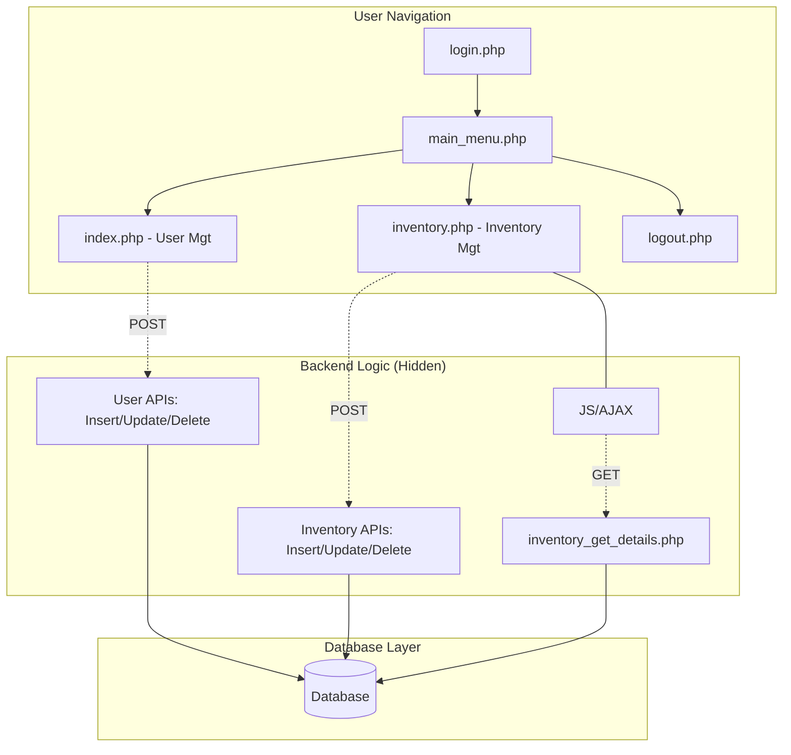
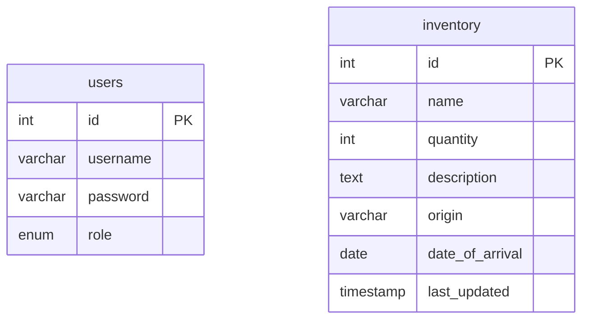

# User and Inventory Management System

This project is a web-based application designed to manage users and inventory. It provides a straightforward user interface for creating, viewing, updating, and deleting records in both a user database and an inventory database.

## Features

-   **User Management:** Secure login and user management with different roles (Admin, User).
-   **Inventory Management:** A comprehensive system for managing inventory items, including details like quantity, origin, and arrival date.
-   **Interactive UI:** Utilizes modals for a smooth user experience when adding, viewing, and updating records.
-   **Clear Project Structure:** Separation of concerns with dedicated files for different functionalities and a separate JavaScript file for client-side interactions.

## Getting Started

### Prerequisites

-   A web server environment like XAMPP, WAMP, or MAMP.
-   MySQL database.

### Setup

1.  Place the project files in your web server's root directory (e.g., `htdocs` for XAMPP).
2.  Create a new MySQL database.
3.  Import the database schema. You can use the following SQL commands to create the `users` and `inventory` tables:
    ```sql
    CREATE TABLE `users` (
      `id` int(11) NOT NULL AUTO_INCREMENT,
      `username` varchar(255) NOT NULL,
      `password` varchar(255) NOT NULL,
      `role` enum('user','admin') NOT NULL DEFAULT 'user',
      PRIMARY KEY (`id`)
    ) ENGINE=InnoDB DEFAULT CHARSET=utf8mb4;

    CREATE TABLE `inventory` (
      `id` int(11) NOT NULL AUTO_INCREMENT,
      `name` varchar(255) NOT NULL,
      `quantity` int(11) NOT NULL,
      `description` text DEFAULT NULL,
      `origin` varchar(255) NOT NULL,
      `date_of_arrival` date NOT NULL,
      `last_updated` timestamp NOT NULL DEFAULT current_timestamp() ON UPDATE current_timestamp(),
      PRIMARY KEY (`id`)
    ) ENGINE=InnoDB DEFAULT CHARSET=utf8mb4;
    ```
4.  Update `connection.php` with your database credentials (host, username, password, database name).
5.  Access the project through your web browser (e.g., `http://localhost/Final-proj/login.php`).

## Project Structure

This chart illustrates the flow of the application and how the files interact with each other.



## Database Schema

This diagram shows the structure of the `users` and `inventory` tables.


